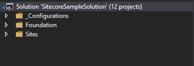
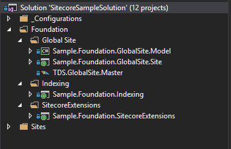
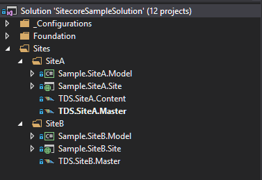

Introduction

When working with Sitecore, there are many paths to achieve the same final experience. Some of these paths may be more efficient than others, while all remaining reasonably correct within Sitecore’s limits.

The following document is meant to provide insight, guidance, and recommendations in setting up the Visual Studio solution to support development of a multi-site Sitecore instance.

Assumptions 

The guidelines provided in this document assume the following:
- A clean Sitecore Experience Platform 8.1 updated to the latest or 8.2 environment
- This will be the first development in the Sitecore environment
- MVC is the selected presentation mechanism
- Visual Studio 2015
- Team Development for Sitecore (TDS)

Recommended Software and Technologies

The following are the common tools found in a developer’s toolkit while building/working with Sitecore
- Visual Studio 2015
- Glass.Mapper
  - http://www.glass.lu/Mapper
  - “Glass.Mapper is the awesome Open Source mapping framework that allows you to focus on solving your business problems. It does the hard work of converting data from your CMS to something your code can work with.” (taken from http://www.glass.lu/Mapper)
- Sitecore Rocks
  - This is an optional plug-in for Visual Studio, that many developers find help when creating and manipulating Sitecore Artifacts as they do not have to leave Visual Studio.
- Sitecore Item Artifact Synchronization Tool
  - It is important to leverage some tool that allows for the synchronization of Sitecore Items into source control for easy distribution between team members and environments during development. 
  - By placing serialized items into Source Control a team member always knows the most current templates, layouts, etc…that support the current code build.
  - Two of the more popular solutions are
    - Team Development for Sitecore (TDS) by Hedgehog Development
      - http://www.teamdevelopmentforsitecore.com/Download
      - This is a paid product
    - Unicorn
      - https://marketplace.sitecore.net/Modules/Unicorn.aspx
      - Open source project that allows Sitecore items to be serialized to the file system for easy cross environment synchronization and tracking in source control
- SQL 2014
  - Sitecore will run fine against 2008 or 2012
  - Most important is that the same SQL version is used across environments, so that if a backup needs to be restored (say to quickly get a new dev machine working) there will not be a version conflict.
- MongoDB
  - Sitecore 8.1.x officially supports MongoDB 3.0.x, according to Sitecore Support the latest version 3.2 should work but they make no promises
- RoboMongo 
  - An open source application that allows the user to explore and navigate MongoDB in a GUI interface.
  - This is helpful if you are extending the Experience Profile (xProfile) or wanting to confirm goals and patterns are properly collecting.
  - https://robomongo.org/
- GULP
- Bootstrap
- LESS
- Microsoft ASP.NET MVC

MVC Insight

Sitecore uses an implementation of Microsoft ASP.NET MVC. This being an implementation not all common MVC practices or functions exist in the context of Sitecore. 

Starting with version 8.1 Sitecore began introducing a field value on layouts and rendering items to partially support the idea of MVC Areas. Through research and experimentation, it has been found that the additional configuration required to manage MVC Areas with Sitecore does not guarantee any significant return, and therefore is not a recommended feature at this time. With properly defined namespaces, assemblies, and folder structure a separation of responsibility can be achieved.

Presentation elements must be represented by a Sitecore Item Artifact within the Sitecore content tree to be added to a page via an author. Sitecore provides two type of item artifacts that support MVC, Controller Renderings and View Renderings. As a solution is planned out it is important to understand and properly use each rendering type appropriately. The following is a well referenced blog post describing some of the difference between view and control renderings in Sitecore, https://mhwelander.net/2014/06/13/view-renderings-vs-controller-renderings/. 

From our experience working in Sitecore MVC we try to follow the following guidelines when determining if which type should be created.

For View Renderings
- Minimal configuration required, can be as simple as leveraging the Sitecore default RenderModel object as a view model or can easily be used with a custom view model inherited from IRenderingModel.
- If leveraging Glass Mapper as a ORM into Sitecore, inheriting the implementation of GlassViewModel will allow for your custom view model to ‘auto’ hydrate from the assigned data source when set with a default fallback to hydrate from the current page item
- View Renderings do not easily support custom business logic when loading the view model or post back of data gracefully

For Control Renderings
- They look and feel more like traditional ASP.NET MVC
- A controller is assigned to the Sitecore Item Artifact that can then contain any custom business logic required to populate the View Model
- In some instances, there may be a very slight performance increase because of the compiled code
- Control Renderings provide a more familiar post-back setup for data

Visual Studio Setup

In establishing a Visual Studio solution, I have found that a variation on the Sitecore Habitat project (http://habitat.sitecore.net/en) has been successful in providing clear separation of responsibility, easy for new team members to understand, and well-constructed for long term maintenance.

The following will walk through a basic Sitecore solution design called ‘Sitecore Sample Solution’.

The solution is built with 3 main collections for code organization, additional segmentation can be added as dictated by organization practice and solution needs

 

- _Configurations
  - This folder is used to store setup and configuration information, global configuration files, and other scripts that may be required to assist the development team.
- Foundation
  - Foundational projects are service and domain layer code that would be shared across all sites in the Sitecore instance.
  - Foundational projects can reference each other, but should NOT reference any site projects
  - Within in the Foundation folder, each foundation project is placed within its own folder
    - This additional hierarchy allows for multiple projects to be created to support a foundational feature when needed
  - Some examples of project logic that would be placed into Foundation are 
    - Indexing
      - Low level search functionality that can be used as is or built upon for individual site search experiences
  - Sitecore Extensions
    - Used for custom extension methods to Sitecore, MVC, and other types 
    - Examples would include HTML Helper methods, Sitecore processes and pipelines, and custom Sitecore commands
  - Global Site
    - Global Site is the web project that commonly used (shared) controls are built in
    - Sample.Foundation.GlobalSite.Model – is the assembly to support View Models as well as data transfer objects (DTO) of Sitecore data templates.
      - It is common practice when using TDS in a solution, to leverage the code generator to build DTO models of all tracked data templates
    - Sample.Foundation.GlobaSite.Site – this is the web project that you common views, controllers, scripts, etc…will be placed in.
      - Globally required configuration patch files are also normally tracked in this project
 

- Sites
  - Sites folder contains a sub-structure which represents each unique site within you Sitecore Instance
  - A site can reference any Foundation project code but should NOT reference code in other sites.
  - Each site contains a minimum of two project, a web project for web assets such as views, controllers, style elements, and a model project that is used for view models and DTO objects
    - As site needs dictate or complexity evolves additional projects may be required to support the site.
 
